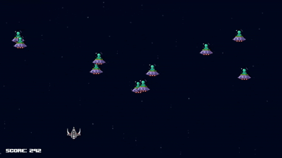

# 👽 Xeno Tide 👾
### A Space Invaders-like game developed entirely in Python with pygame. 

The game features a **main menu with background music**, as well as a **scoring system using SQLite3**.  
It also implements core *Space Invaders-like* mechanics, such as **enemy spawning, collision handling, and bullet firing**.

---

### Demo

---

### 🎮 Game Controls
| Key        | Action                        |
|------------|-------------------------------|
| **ESCAPE** | Return to menu / Exit game    |
| **← / →**  | Move player                   |
| **SPACE**  | Confirm / Shoot               |

---

### 🎵 Credits
*Special thanks to all the artists that gave a soul to this project!*  

#### Music
- **City Surfer** by Cody O'Quinn — [YouTube](https://www.youtube.com/watch?v=zsoZEYpQOnM)  
- **Star Striker** by Cody O'Quinn — [YouTube](https://www.youtube.com/watch?v=lTt_y7G_tkE)  

#### SFX
- *Videogame Menu Select* by **Fupicat** — [Freesound](https://freesound.org/s/471937/) — License: **CC0**  
- *Laser shoot* by **MusicLegends** — [Freesound](https://freesound.org/s/344310/) — License: **Attribution 3.0**  
- *8Bit Explosion* by **Duskbreaker** — [Freesound](https://freesound.org/s/641486/) — License: **CC0**  
- *8-bit "failure" sound* by **AceOfSpadesProduc100** — [Freesound](https://freesound.org/s/333785/) — License: **Attribution 4.0**  

---

### 📜 License
This project is licensed under a permissive license.  
You are free to **use, modify, and share it** as you wish.
